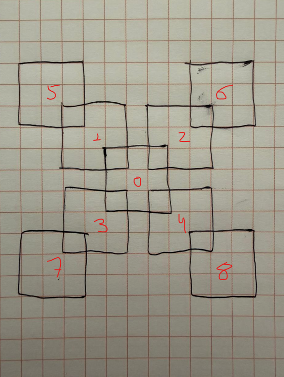

# sudoku

# A objetivo 
    - no repetir numeros del 1 al 9 en filas 
    - no repetir numeros del 1 al 9 en columnas
    - no repetir numeros del 1 al 9 en submatriz 3x3
    - cumplir restricciones tridimencionales entre capas

# Representacion del Estado
Cada estado sera una configuracion parcial del sudoku
ejm: boards[z][x][y]   significa ->  tableros[numero_tablero, fila, columna] = valor

# Representacion matematica
Espacios de estados aproximados es : tableros = 9, filas = 9, columnas = 9
tenemos un 9x9 = 81 casillas
si llenamos sin ninguna restriccion con numeros del 1 al 9 en cada estapacio de estados = 9^81
pero como tenemos 9 tablas  = (9^81)^9

### Esta es la imagen de referencia

# conexiones 

Si tomamos cada tablero como una matriz de 9x9 (donde las filas y columnas van del 0 al 8):
* Tablero 0 (Centro) con los internos (1, 2, 3, 4):
    - El 3x3 arriba-izquierda del 0 es el abajo-derecha del 1.
    - El 3x3 arriba-derecha del 0 es el abajo-izquierda del 2.
    - El 3x3 abajo-izquierda del 0 es el arriba-derecha del 3.
    - El 3x3 abajo-derecha del 0 es el arriba-izquierda del 4.

* Tableros internos con los externos (5, 6, 7, 8):
    - El 3x3 arriba-izquierda del 1 es el abajo-derecha del 5.
    - El 3x3 arriba-derecha del 2 es el abajo-izquierda del 6.
    - El 3x3 abajo-izquierda del 3 es el arriba-derecha del 7.
    - El 3x3 abajo-derecha del 4 es el arriba-izquierda del 8.

# algoritmo A* 
 
        f(n) = g(n) + h(n)

g(n) =  costo acumulado
h(n) = heuristica estimada al objetivo

# modelamiento:
en el sudoku: Cada movimiento cuensta 1

- g(n) = cantidad de celdas llenadas

- h(n) = cantidad de celdas vacias

** porque la heuristica es si hay menos casillas haya mas cerca de la solucion **

# digrama inicial
    Estado
      ↓
Nodo (g,h,f)
      ↓
Priority Queue (heapq)
      ↓
      A*

# NODO
class Nodo:
    def __init__(self, estado, padre=None, g=0):
        self.estado = estado
        self.padre = padre

        # costo acumulado
        self.g = g

        # heurística
        self.h = self.heuristica()

        # función A*
        self.f = self.g + self.h

# HEURISTICA
def heuristica(self):
    vacios = 0

    for z in range(9):
        for x in range(9):
            for y in range(9):
                if self.estado.grid[z][x][y] == 0:
                    vacios += 1

    return vacios

# PRIORIDAD COLA
import heapq
def __lt__(self, other):
    return self.f < other.f

- Esto permite comparar nodos automáticamente.

# A*
def buscar(self):

    frontera = []

    heapq.heappush(frontera, self.raiz)

    while frontera:

        nodo_actual = heapq.heappop(frontera)

        self.nodos_visitados += 1

        resultado = nodo_actual.expandir()

        if resultado == "SOLUCION_ALCANZADA":

            print("SOLUCION ENCONTRADA")
            print("Nodos:", self.nodos_visitados)

            return nodo_actual.estado

        if not resultado:
            self.backtracks += 1
            continue

        for hijo in resultado:
            heapq.heappush(frontera, hijo)

    return None

-   Explora el nodo mas prometedor
-   No explora profundidad arbitrariamente
-   minimiza f(n)

